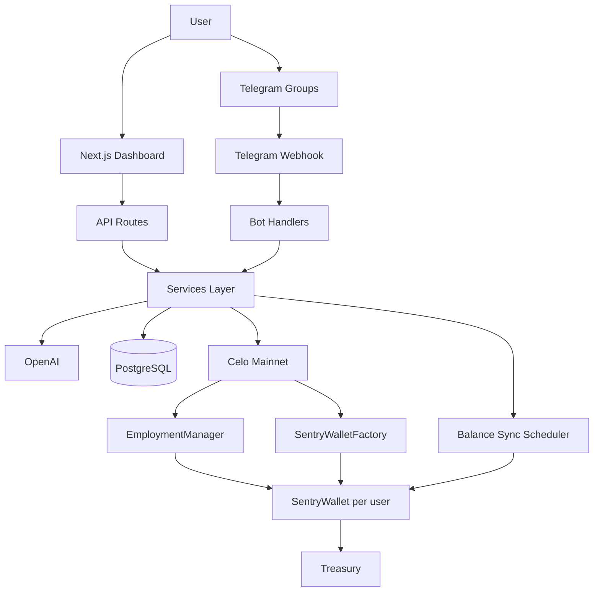

# Sentry

An AI employee for Telegram that businesses and individuals hire to monitor conversations, welcome members, answer mentions, moderate spam, and generate summaries — billed per completed action from a prepaid employment wallet on **Celo Mainnet**.

## Overview

Sentry is a pay-per-completed-work product:

1. User selects an enabled currency and hires Sentry → **SentryWalletFactory** deploys a permanent, manager-controlled `SentryWallet`.
2. User funds the wallet (**web deposit** or **direct transfer** + sync).
3. Sentry joins Telegram groups and performs billable work.
4. Completed work accumulates as **outstanding charges** off-chain; batch **settlements** settle on-chain via `chargeSettlement()`.
5. **Available balance** = on-chain balance − outstanding charges. Work stops when available balance is exhausted.

Supported payment currencies: **CELO**, **USDm**, **USDC**, **USDT**. Each wallet keeps one immutable currency; admins enable/disable currencies only for future wallets.

## Architecture



**Identity:** Backend computes `keccak256("email:…")` / `telegram:…` / `wallet:…` — contract stores only `bytes32 identityHash`.

## Funding (dual methods)

| Method | Flow |
|--------|------|
| **A — Web deposit** | Connect wallet → transfer the wallet's immutable CELO or ERC20 currency directly to `SentryWallet` → auto sync |
| **B — Direct transfer** | Send CELO / USDm / USDC / USDT to `SentryWallet` → **Sync Balance** |

Scheduled sync runs every 5 minutes; users can also trigger `/api/wallet/sync`.

## Custody and withdrawals

- `SentryWallet` is controlled only by `EmploymentManager`; users and the backend never own wallet keys.
- Users register a separate EVM withdrawal destination (MiniPay, MetaMask, Valora, Safe, etc.).
- Withdrawable balance is wallet balance minus outstanding charges and the estimated settlement fee.
- If charges are outstanding, the backend settles them before asking `EmploymentManager` to transfer the remainder.
- Every settlement and withdrawal has independent replay protection and database history.

## Local setup

```bash
pnpm install
cp .env.example .env
pnpm prisma:generate
pnpm prisma:migrate
pnpm start:all    # migrate + dev server (see Scripts for scheduler/bot)
```

Point Telegram webhook to `POST /api/telegram`.

### Telegram setup

1. Create a bot via [@BotFather](https://t.me/BotFather) and set `TELEGRAM_BOT_TOKEN`.
2. Set webhook: `https://api.telegram.org/bot<TOKEN>/setWebhook?url=<YOUR_URL>/api/telegram`
3. For local dev, use `pnpm bot:poll` instead of webhooks.

## Environment variables

| Variable | Purpose |
|----------|---------|
| `DATABASE_URL` | PostgreSQL connection |
| `TELEGRAM_BOT_TOKEN` | Telegram bot token |
| `OPENAI_API_KEY` | OpenAI API key |
| `CELO_RPC` | Celo Mainnet RPC |
| `SENTRY_OPERATOR_KEY` | Operator key for on-chain charges |
| `SENTRY_OWNER_KEY` | Owner key for admin contract calls |
| `EMPLOYMENT_MANAGER_ADDRESS` / `SENTRY_WALLET_FACTORY_ADDRESS` | Deployed custody contracts |
| `CELO_USDM_ADDRESS` / `USDC` / `USDT` | ERC-20 addresses used for future wallets |
| `ADMIN_EMAILS` | Comma-separated admin emails |
| `DEMO_MODE` | Set `true` to scale pricing down 100× for judge demos |
| `SETTLEMENT_MONETARY_THRESHOLD` | Batch settle when outstanding charges reach this amount |
| `SETTLEMENT_ACTION_THRESHOLD` | Batch settle after this many unsettled actions |
| `SETTLEMENT_INTERVAL_MINUTES` | Maximum time between settlements |
| `SETTLEMENT_FEE_ESTIMATE` | Estimated gas fee added to each settlement |
| `SETTLEMENT_FEE_BUFFER_PERCENT` | Extra buffer on settlement fee estimates (default 10) |

## Testing

```bash
pnpm test                 # Backend unit tests (identity, pricing, currency)
pnpm test:contracts       # Hardhat smart contract tests
pnpm --dir smartContracts coverage
```

## Celo Mainnet deployment

```bash
cd smartContracts && pnpm install && pnpm compile && pnpm deploy-celo
cd .. && pnpm contracts:sync
```

Deploys `EmploymentManager` and `SentryWalletFactory`, then syncs their ABIs to `lib/contracts/`. The factory creates one manager-controlled, single-currency `SentryWallet` per identity. `MockERC20` remains test-only and is never deployed.

## Demo checklist

- [ ] User hires Sentry → employment wallet created (address never changes)
- [ ] Fund wallet (web deposit and/or direct transfer + sync)
- [ ] Balance updates on dashboard
- [ ] Bot joins Telegram group, mention reply works
- [ ] FAQ / welcome / summary run
- [ ] ActionRecord accrual + successful batch settlement
- [ ] Transaction visible on Celo explorer

## Scripts

```bash
pnpm start:all          # prisma generate + migrate + dev server
pnpm dev
pnpm scheduler        # Cron: summaries, cleanup, wallet sync (every 5 min)
pnpm bot:poll         # Telegram polling (dev)
pnpm contracts:compile
pnpm contracts:sync
```

Set `DEMO_MODE=true` in `.env` for hackathon demos with micro-priced actions (e.g. 0.0001 instead of 0.01).
