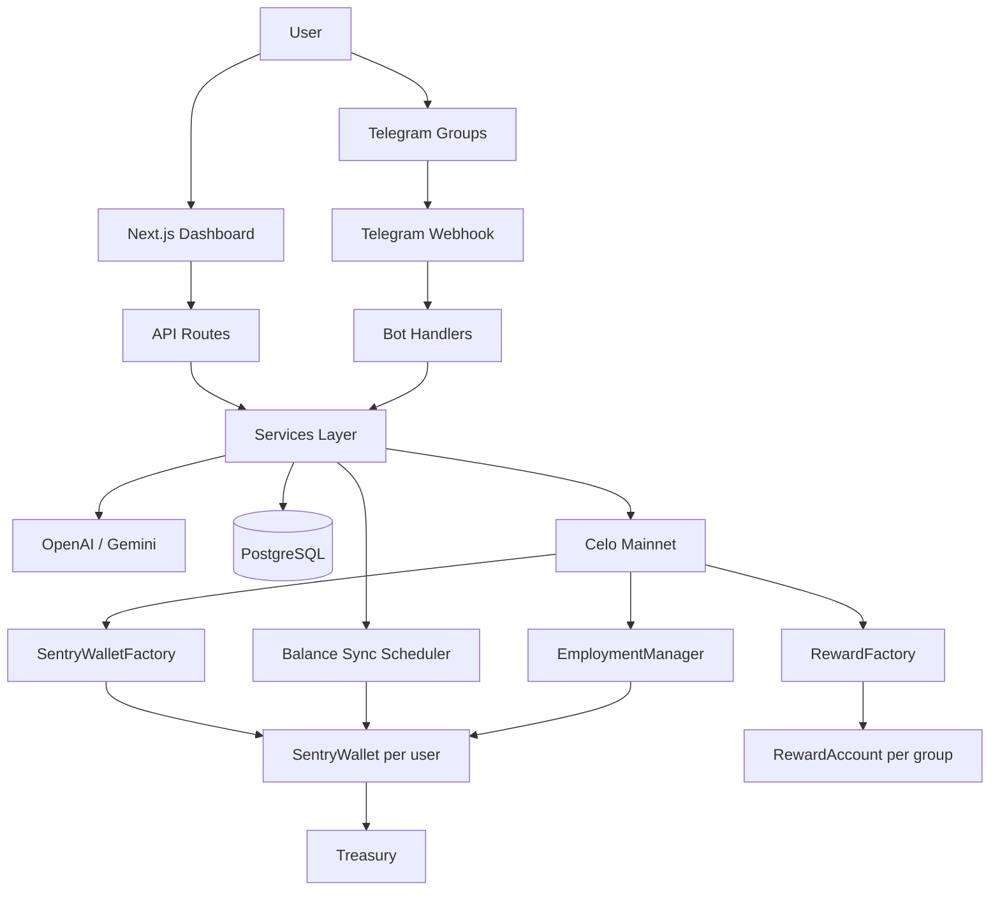

# Sentry

An intelligent AI Telegram employee that businesses and individuals hire to run communities: answer questions with context, welcome members, moderate spam, host polls/trivia/games with points & cash rewards, and report what it did — billed per completed action from a prepaid employment wallet on **Celo Mainnet**.

## Overview

Sentry is not a shallow command bot. It behaves like a digital teammate that understands group context, stays lively when engagement is enabled, and only claims work it is configured and funded to perform.

Pay-per-completed-work flow:

1. User selects an enabled currency and hires Sentry → **SentryWalletFactory** deploys a permanent, manager-controlled `SentryWallet`.
2. User funds the wallet (**web deposit** or **direct transfer** + sync).
3. Sentry joins Telegram groups and performs billable work.
4. Completed work accumulates as **outstanding charges** off-chain; batch **settlements** settle on-chain via `chargeSettlement()`.
5. **Available balance** = on-chain balance − outstanding charges. Work stops when available balance is exhausted.

Supported payment currencies: **CELO**, **USDm**, **USDC**, **USDT**. Each wallet keeps one immutable currency; admins enable/disable currencies only for future wallets.

### What Sentry can do

| Area | Capabilities |
|------|----------------|
| **Community Q&A** | Mentions & replies, FAQ + knowledge base, grounded agent answers (no FAQ dumps on “hi/thanks”) |
| **Moderation** | Spam warn/delete, admin `/ban` `/mute` `/unmute`, optional Rose relay |
| **Engagement** | Polls, quizzes, learn-and-earn, fun/comics, Twitter/X social campaigns (employer toggles) |
| **Games & rewards** | Inline-button quizzes with instant judging, points balances, optional cash payouts via **RewardFactory** / **RewardAccount** |
| **Member hub** | `/mystatus` and `/points` — interactive buttons for points, pending cash, games, leaderboard, withdraw help |
| **Ops** | Welcomes, announcements, birthdays, daily summaries, shift handovers, escalation ladder, playbooks |
| **Employer** | Dashboard + DM menu (`/menu`), secretary mode (Telegram Business), agent-to-agent HTTP API |
| **Voice** | Distinctive, well-formatted Telegram replies (HTML + comic display styling) |

## Architecture



**Identity:** Backend computes `keccak256("email:…")` / `telegram:…` / `wallet:…` — contract stores only `bytes32 identityHash`.

**Rewards (separate custody):** Engagement points live in Postgres. Optional cash rewards use a standalone `RewardFactory` + `RewardAccount` (same custody pattern as employment wallets, without modifying existing employment contracts). Employers fund the reward account; members withdraw by tagging Sentry with a `0x` address.

## Funding (dual methods)

| Method | Flow |
|--------|------|
| **A — Web deposit** | Connect wallet → transfer the wallet's immutable CELO or ERC20 currency directly to `SentryWallet` → auto sync |
| **B — Direct transfer** | Send CELO / USDm / USDC / USDT to `SentryWallet` → **Sync Balance** |

Scheduled sync runs every 5 minutes; users can also trigger `/api/wallet/sync`.

## Custody and withdrawals

- `SentryWallet` is controlled only by `EmploymentManager`; users and the backend never own wallet keys.
- Users register a separate EVM withdrawal destination (MiniPay, MetaMask, Valora, Safe, etc.).
- Withdrawable balance is wallet balance minus outstanding charges and the estimated settlement fee.
- If charges are outstanding, the backend settles them before asking `EmploymentManager` to transfer the remainder.
- Every settlement and withdrawal has independent replay protection and database history.
- Member **reward** withdrawals (points → cash) use the group `RewardAccount` when the employer has enabled and funded rewards.

## Local setup

```bash
pnpm install
cp .env.example .env
pnpm prisma:generate
pnpm prisma:migrate
pnpm start:all    # migrate + dev server (see Scripts for scheduler/bot)
```

Point Telegram webhook to `POST /api/telegram`. Prefer `TELEGRAM_WEBHOOK_SECRET` + `pnpm bot:webhook` so Telegram sends `x-telegram-bot-api-secret-token`.

### Telegram setup

1. Create a bot via [@BotFather](https://t.me/BotFather) and set `TELEGRAM_BOT_TOKEN`.
2. Optionally set `TELEGRAM_WEBHOOK_SECRET` (32+ random hex bytes) on the host and locally.
3. Register webhook + command menus: `pnpm bot:webhook` (uses `NEXT_PUBLIC_API_URL` / `WEBHOOK_BASE_URL`).
4. For local dev without HTTPS, use `pnpm bot:poll` instead of webhooks.

## Environment variables

| Variable | Purpose |
|----------|---------|
| `DATABASE_URL` | PostgreSQL connection |
| `TELEGRAM_BOT_TOKEN` | Telegram bot token |
| `TELEGRAM_WEBHOOK_SECRET` | Optional shared secret for webhook auth |
| `OPENAI_API_KEY` | OpenAI API key |
| `CELO_RPC` | Celo Mainnet RPC |
| `SENTRY_OPERATOR_KEY` | Operator key for on-chain charges / reward payouts |
| `SENTRY_OWNER_KEY` | Owner key for admin contract calls |
| `EMPLOYMENT_MANAGER_ADDRESS` / `SENTRY_WALLET_FACTORY_ADDRESS` | Deployed custody contracts |
| `REWARD_FACTORY_ADDRESS` | Optional override for RewardFactory (after deploy + sync) |
| `CELO_USDM_ADDRESS` / `USDC` / `USDT` | ERC-20 addresses used for future wallets |
| `ADMIN_EMAILS` | Comma-separated admin emails |
| `DEMO_MODE` | Set `true` to scale pricing down 100× for judge demos |
| `SETTLEMENT_MONETARY_THRESHOLD` | Batch settle when outstanding charges reach this amount |
| `SETTLEMENT_ACTION_THRESHOLD` | Batch settle after this many unsettled actions |
| `SETTLEMENT_INTERVAL_MINUTES` | Maximum time between settlements |
| `SETTLEMENT_FEE_ESTIMATE` | Estimated gas fee added to each settlement |
| `SETTLEMENT_FEE_BUFFER_PERCENT` | Extra buffer on settlement fee estimates (default 10) |
| `FEE_CURRENCY` | Gas payment mode: omit/`celo` (default) or `stable` for CIP-64 fee abstraction |
| `FEE_CURRENCY_STABLE` | When `FEE_CURRENCY=stable`: `USDm` (default), `USDC`, or `USDT` |
| `FEE_CURRENCY_ADDRESS` | Optional override of the CIP-64 `feeCurrency` address (use adapter for USDC/USDT) |

## Testing

```bash
pnpm test                 # Backend unit tests (identity, pricing, currency)
pnpm test:contracts       # Hardhat smart contract tests
pnpm --dir smartContracts coverage
```

## Celo Mainnet deployment

```bash
cd smartContracts && pnpm install && pnpm compile && pnpm deploy-celo
cd .. && pnpm contracts:sync
```

Deploys `EmploymentManager` and `SentryWalletFactory` (and reward contracts when included in the deploy script), then syncs ABIs to `lib/contracts/`. The employment factory creates one manager-controlled, single-currency `SentryWallet` per identity. `MockERC20` remains test-only and is never deployed.

## Demo checklist

- [ ] User hires Sentry → employment wallet created (address never changes)
- [ ] Fund wallet (web deposit and/or direct transfer + sync)
- [ ] Balance updates on dashboard
- [ ] Bot joins Telegram group, mention reply works with clean formatting
- [ ] FAQ / welcome / summary run
- [ ] Enable engagement → start poll/trivia → inline answers + `/mystatus` points
- [ ] Optional: fund RewardAccount → member withdraw with `0x` address
- [ ] ActionRecord accrual + successful batch settlement
- [ ] Transaction visible on Celo explorer

## Scripts

```bash
pnpm start:all          # prisma generate + migrate + dev server
pnpm dev
pnpm scheduler          # Cron: summaries, cleanup, wallet sync (every 5 min)
pnpm bot:poll           # Telegram polling (dev)
pnpm bot:webhook        # Set webhook + register / command menus
pnpm contracts:compile
pnpm contracts:sync
```

Set `DEMO_MODE=true` in `.env` for hackathon demos with micro-priced actions (e.g. 0.0001 instead of 0.01).

## Public verifiability statement

Sentry is a Telegram community operations agent for employer-controlled workflows. The public evidence for the product is intentionally narrow and factual: it can answer FAQ-style questions, moderate spam, host polls and quizzes, send shift summaries, and report wallet and action states in plain language. The employer chooses which features are enabled, controls the wallet funding, and reviews the configured workflow.

The public-facing statement is therefore limited to observable product functions and employer-controlled workflows. We do not claim hidden custody, undocumented security controls, legal authority over user funds, or autonomous execution beyond the configured rules and visible workflow outputs. Where the public page cannot show a fact directly, we do not present it as verified.

This is the standard we use in all public-facing product writing: describe the live operational model, the user-controlled settings, and the visible outputs — and avoid unverified claims about privacy, custody, data handling, or backend ownership unless they are explicitly disclosed and evidenced.

<!-- The site's metadata claims to offer an "AI Telegram Employee" providing FAQs, moderation, polls, learn-and-earn games with points and cash rewards, work reports, and payments from a prepaid Celo wallet. However, none of these functional claims can be verified from publicly observable evidence: all seven responses report that the returned HTML contained only title and meta description tags, with no rendered headings, links, forms, buttons, images, or executed JavaScript. Specifically unverifiable are privacy policies, security controls, custody models, wallet ownership or boundaries, Celo contract addresses, on-chain transaction evidence, Telegram integration details, AI implementation, reward mechanisms, and payment execution flows. While HTTPS delivery and a 200 response were observable, the page provided no documentation, technical specifications, or visible interface elements to independently confirm how the service works, who controls user funds, what data is collected, or whether the advertised capabilities exist. -->