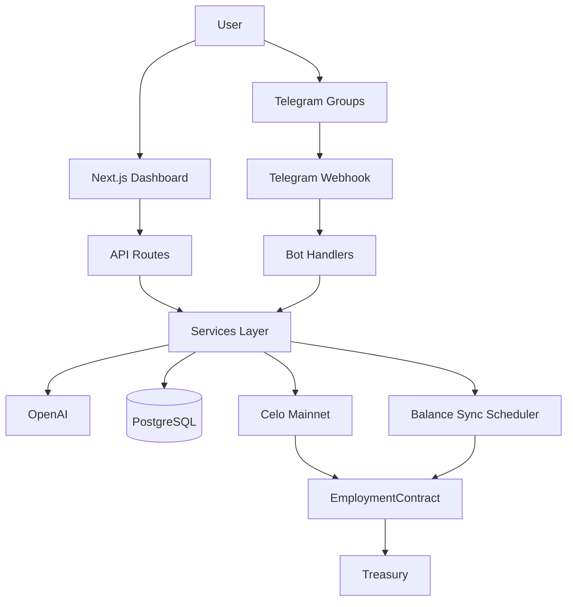

# Sentry

An AI employee for Telegram that businesses and individuals hire to monitor conversations, welcome members, answer mentions, moderate spam, and generate summaries — billed per completed action from a prepaid employment wallet on **Celo Mainnet**.

## Overview

Sentry is a pay-per-completed-work product:

1. User hires Sentry and receives a permanent employment smart wallet address.
2. User funds the wallet (**web deposit** or **direct transfer** + sync).
3. Sentry joins Telegram groups and performs billable work.
4. Each completed action triggers an on-chain `charge()` — **blockchain is the source of truth**.
5. When balance reaches zero, employment exhausts automatically.

Supported payment currencies (global, admin-configured): **CELO**, **USDm**, **USDC**, **USDT**.

## Architecture



**Identity:** Backend computes `keccak256("email:…")` / `telegram:…` / `wallet:…` — contract stores only `bytes32 identityHash`.

## Funding (dual methods)

| Method | Flow |
|--------|------|
| **A — Web deposit** | Connect wallet → `depositNativeFor(employmentWallet)` or `depositERC20For` → Sync Balance |
| **B — Direct transfer** | Send CELO / USDm / USDC / USDT → employment wallet → **Sync Balance** |

Scheduled sync runs every 5 minutes; users can also trigger `/api/wallet/sync`.

## Local setup

```bash
pnpm install
cp .env.example .env
pnpm prisma:generate
pnpm prisma:migrate
pnpm dev
```

Point Telegram webhook to `POST /api/telegram`.

## Environment variables

| Variable | Purpose |
|----------|---------|
| `DATABASE_URL` | PostgreSQL connection |
| `TELEGRAM_BOT_TOKEN` | Telegram bot token |
| `OPENAI_API_KEY` | OpenAI API key |
| `CELO_RPC` | Celo Mainnet RPC |
| `SENTRY_OPERATOR_KEY` | Operator key for on-chain charges |
| `SENTRY_OWNER_KEY` | Owner key for admin contract calls |
| `CELO_USDM_ADDRESS` / `USDC` / `USDT` | ERC-20 addresses on Celo |
| `ADMIN_EMAILS` | Comma-separated admin emails |

## Testing

```bash
pnpm test                 # Backend unit tests (identity, pricing, currency)
pnpm test:contracts       # Hardhat smart contract tests
```

## Celo Mainnet deployment

```bash
cd smartContracts && pnpm install && pnpm compile && pnpm deploy-celo
cd .. && pnpm contracts:sync
```

## Demo checklist

- [ ] User hires Sentry → employment wallet created (address never changes)
- [ ] Fund wallet (web deposit and/or direct transfer + sync)
- [ ] Balance updates on dashboard
- [ ] Bot joins Telegram group, mention reply works
- [ ] FAQ / welcome / summary run
- [ ] ActionRecord + successful on-chain charge
- [ ] Transaction visible on Celo explorer

## Scripts

```bash
pnpm dev
pnpm scheduler        # Cron: summaries, cleanup, wallet sync
pnpm bot:poll         # Telegram polling (dev)
pnpm contracts:compile
pnpm contracts:sync
```
